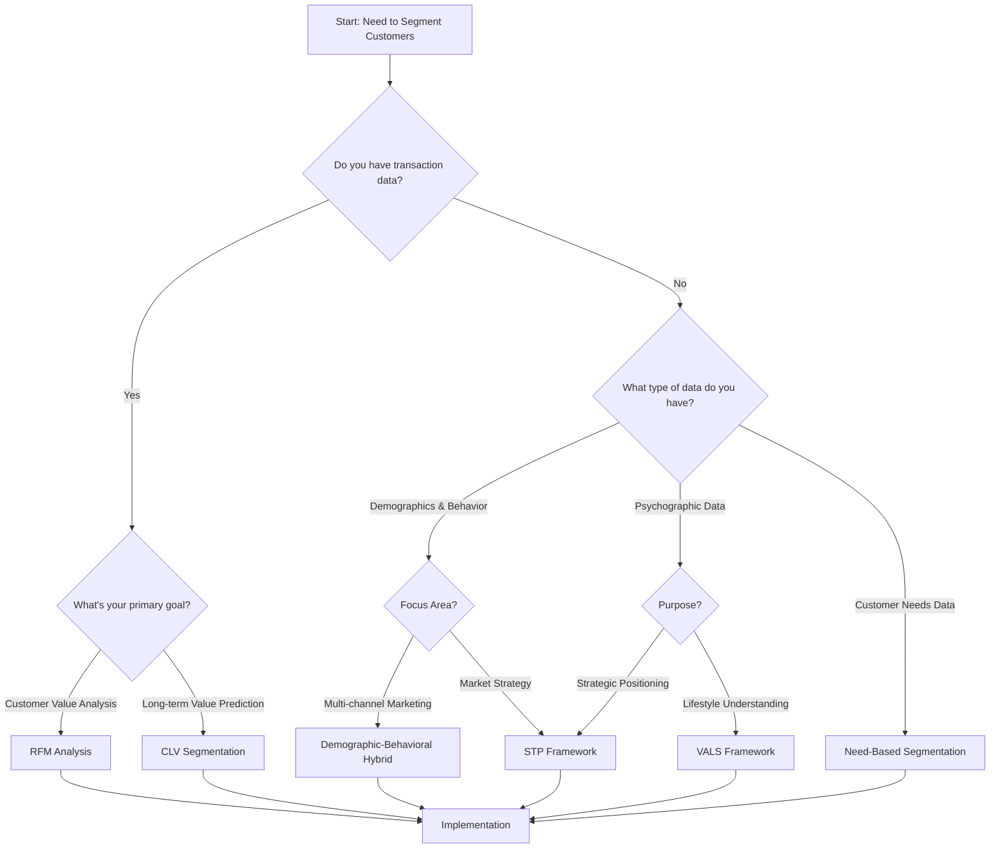
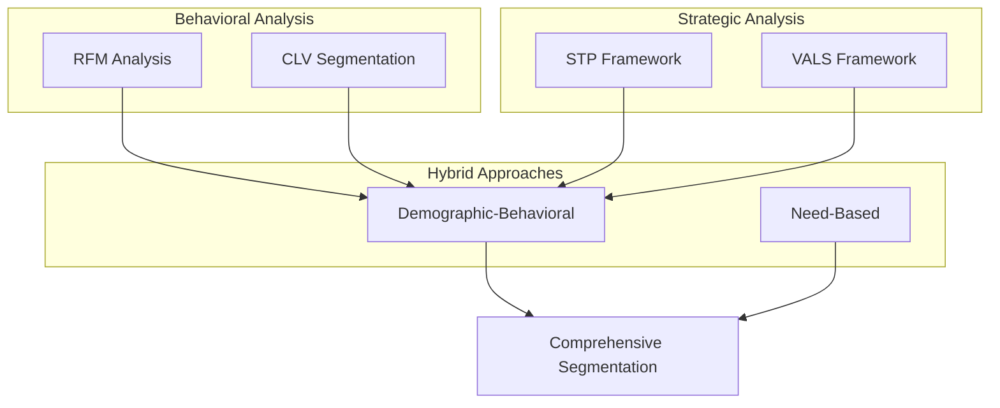

# Understanding Customer Segmentation Frameworks

### RFM Analysis
- Leverages transactional data to group customers based on their purchasing behavior
- Recency: How recently a customer made a purchase indicates engagement level
- Frequency: Number of transactions shows loyalty and engagement strength
- Monetary: Total spending reveals customer's value contribution
- Most effective for retail and e-commerce businesses needing quick, actionable insights
- Success relies heavily on consistent transaction data quality

### STP Framework
- Strategic approach to divide market and position products/services
- Segmentation phase identifies distinct customer groups with similar needs
- Targeting evaluates segment attractiveness and company fit
- Positioning creates unique value proposition for chosen segments
- Particularly valuable for new market entry or product launches
- Requires comprehensive market research and competitive analysis

### VALS Framework
- Focuses on psychological aspects and lifestyle choices
- Categorizes people based on their primary motivations
- Considers resources like income, education, and self-confidence
- Innovation levels determine technology adoption patterns
- Essential for brand strategy and marketing communications
- Cultural sensitivity critical for international markets

### CLV Segmentation
- Predicts future value potential of customer relationships
- Combines historical purchase data with predictive analytics
- Considers customer longevity and retention probability
- Incorporates risk factors and churn likelihood
- Vital for resource allocation and loyalty programs
- Requires regular model updates and validation

### Demographic-Behavioral Hybrid
- Merges traditional demographic data with behavioral insights
- Combines static customer attributes with dynamic actions
- Tracks multi-channel interactions and preferences
- Enables personalized marketing approaches
- Particularly effective for omnichannel strategies
- Success depends on data integration quality

### Need-Based Segmentation
- Groups customers by their core problems and goals
- Focuses on solution requirements rather than demographics
- Especially valuable in B2B contexts
- Maps customer pain points to product features
- Drives product development and service design
- Requires deep understanding of customer challenges

